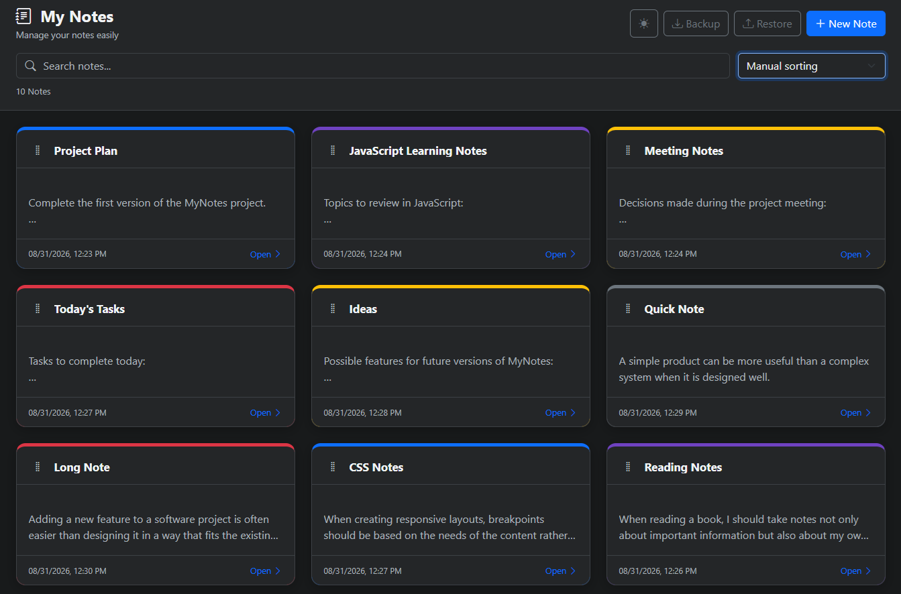

# MyNotes

A lightweight, offline-first notes application built with **HTML, CSS, and vanilla JavaScript**.

MyNotes runs directly in the browser, stores notes locally, and can optionally be installed as a **Progressive Web App (PWA)** on supported devices.

**No backend or database server is required.**

## Live Demo

**[🚀 Open MyNotes](https://hasangurler.github.io/MyNotes/)**

Try MyNotes directly in your browser. No installation or account is required.

## Screenshot



---

## Features

* Create, edit, and delete notes
* Search notes by title or content
* Sort notes by:

  * Recently updated
  * Recently created
  * Title A–Z
  * Title Z–A
  * Manual order
* Drag and drop notes when manual sorting is enabled
* Light and dark themes
* Custom note colors
* Character counters for titles and note content
* Client-side form validation
* Confirmation dialogs for destructive and data-changing actions
* Toast notifications
* JSON backup and restore
* Responsive interface for desktop and mobile devices
* Local data persistence using `localStorage`
* Offline-capable Progressive Web App
* Optional PWA installation on supported browsers and devices
* Native file sharing on supported mobile browsers
* No backend required

---

## Why MyNotes?

MyNotes is more than a simple notes application. It is also an example of how modern web technologies can be used to build a practical cross-platform application without introducing a backend or a complex development environment.

The project demonstrates how:

* HTML can provide the application structure.
* CSS can create a responsive and themeable user interface.
* Vanilla JavaScript can handle application state and user interactions.
* `localStorage` can provide persistent client-side storage.
* Browser APIs can provide file handling and native sharing capabilities.
* A Service Worker can provide offline functionality.
* A Web App Manifest can make the application installable as a PWA.

The same application can therefore be used in two different ways:

**Use it directly in a browser**

No installation is required. Open the application and start using it.

**Install it as a PWA**

On supported browsers and devices, MyNotes can be installed and launched as a standalone application.

---

## Technology Stack

MyNotes deliberately uses a lightweight technology stack:

* **HTML5**
* **CSS3**
* **Vanilla JavaScript**
* **Bootstrap**
* **Bootstrap Icons**
* **Web APIs**
* **LocalStorage**
* **Service Worker**
* **Web App Manifest**

There is no frontend framework, backend API, database server, package manager, or build pipeline required to run the application.

---

## Architecture

The application is primarily built around three source files:

```text
index.html
css/style.css
js/app.js
```

Their responsibilities are intentionally separated:

### `index.html`

Defines the application structure and user interface.

It contains:

* Application header
* Search and sorting controls
* Notes container
* Note editor modal
* Confirmation modal
* Toast container
* PWA metadata
* References to CSS and JavaScript resources

### `css/style.css`

Contains the application's custom styling.

It is responsible for:

* Application layout
* Responsive behavior
* Light and dark themes
* Note card styling
* Note colors
* Modal customization
* Drag-and-drop visual states
* Mobile-specific adjustments
* Toast styling

Bootstrap provides the general UI framework, while `style.css` contains the application-specific design.

### `js/app.js`

Contains the application's behavior and business logic.

It handles:

* Application initialization
* Application state
* Note creation, editing, and deletion
* LocalStorage persistence
* Searching
* Sorting
* Drag-and-drop ordering
* Theme management
* Form validation
* Character counters
* Backup and restore
* Browser API integration
* Modal and toast interactions
* Keyboard shortcuts

---

## Project Structure

```text
MyNotes/
│
├── index.html
├── manifest.json
├── service-worker.js
├── favicon.png
│
├── css/
│   ├── bootstrap.min.css
│   ├── bootstrap-icons.css
│   ├── style.css
│   │
│   └── fonts/
│       ├── bootstrap-icons.woff
│       └── bootstrap-icons.woff2
│
├── js/
│   ├── bootstrap.bundle.min.js
│   └── app.js
│
├── README.md
├── LICENSE
└── .gitignore
```

The application itself is primarily implemented in `index.html`, `css/style.css`, and `js/app.js`.

Bootstrap and Bootstrap Icons are included locally as vendor dependencies so the project does not depend on external CDN resources at runtime.

---

## Data Storage

MyNotes does not require a remote database.

Notes are stored in the browser using the **Web Storage API**, specifically `localStorage`.

The application stores the notes under the following storage key:

```javascript
const STORAGE_KEY = "notes_app_data";
```

The selected theme is stored separately:

```javascript
const THEME_KEY = "notes_app_theme";
```

This approach allows the application to preserve notes and preferences between browser sessions.

Because the data is stored locally, the notes are associated with the browser and device where they were created.

---

## Backup and Restore

To avoid relying entirely on browser-local storage, MyNotes provides a JSON backup and restore mechanism.

### Backup

The application serializes the current notes array into JSON and creates a backup file.

On supported mobile browsers, MyNotes uses the **Web Share API** when possible.

On browsers where file sharing is unavailable, the application falls back to a standard browser file download.

### Restore

A previously created JSON backup can be selected from the device.

The application:

1. Reads the selected file.
2. Parses the JSON data.
3. Validates the imported notes.
4. Normalizes the data.
5. Requests confirmation from the user.
6. Replaces the current notes with the restored data.

This provides a simple way to move notes between devices or preserve them independently of browser storage.

---

## Progressive Web App

MyNotes includes the basic components required for a Progressive Web App:

```text
manifest.json
service-worker.js
```

The Web App Manifest provides installation metadata, while the Service Worker enables the application to operate offline after the required resources have been cached.

On supported browsers and devices, users can install MyNotes and launch it as a standalone application.

The application does not require a native Android, iOS, Windows, or macOS installation package.

---

## Running Locally

MyNotes does not require a build step.

However, because the application uses PWA functionality such as a Service Worker, it should be served through a local web server rather than opened directly with the `file://` protocol.

For example, after cloning the repository, the project can be served using any simple static web server.

The application can then be opened in a browser through a local HTTP address.

---

## Browser APIs Used

MyNotes demonstrates the use of several standard browser APIs:

### LocalStorage

Used for persistent local application data.

### File API

Used to create and read JSON backup files.

### Web Share API

Used to provide native file sharing on supported mobile browsers.

### Crypto API

`crypto.randomUUID()` is used when available to generate unique note identifiers.

### Service Worker API

Used to support offline application behavior.

### DOM API

Used extensively for rendering notes, handling events, updating the interface, and managing application state.

---

## Security Considerations

MyNotes is a client-side application and does not send notes to a remote server.

User-entered content is escaped before being inserted into generated HTML to reduce the risk of HTML injection.

For example, the application uses an `escapeHtml()` helper before inserting note data into the interface.

Because notes are stored in browser-local storage, users should understand that clearing browser data can remove locally stored notes. The built-in JSON backup feature can be used to preserve or transfer data.

---

## Design Philosophy

MyNotes follows a simple principle:

> **Build a useful application with the platform before adding unnecessary complexity.**

The project intentionally avoids a framework and backend so that the underlying browser technologies remain visible and understandable.

This makes the project suitable as both a practical application and a learning example for developers interested in:

* Cross-platform web applications
* Progressive Web Apps
* Offline-first development
* Client-side data storage
* Vanilla JavaScript
* Responsive web design
* Browser APIs
* Static web hosting

---

## Contributing

Contributions, suggestions, and improvements are welcome.

If you find a bug or have an idea for improving MyNotes, please open an issue or submit a pull request.

Before submitting a pull request, please make sure that the existing functionality continues to work on both desktop and mobile browsers.

---

## License

MyNotes is released under the **MIT License**.

See the [`LICENSE`](LICENSE) file for the complete license text.
